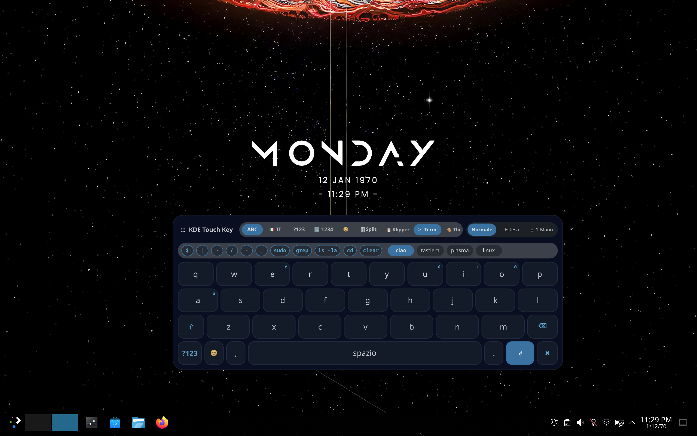

# ⌨️ Plasma Touch Key (Tastiera)


---

> **Next-Generation Virtual Keyboard for KDE Plasma 6 & Wayland**  
> Designed for Linux tablets, touchscreens, and postmarketOS devices running KDE Plasma 6 Wayland.



---

## ✨ Features

- ⚡ **Native Wayland & LayerShell Protocol**: Designed from scratch for KDE Plasma 6 with `zwp_virtual_keyboard_v1`, `zwp_input_method_v2`, and `LayerShellQt`. Guarantees **zero focus stealing** when typing into terminals or native applications.
- 🎨 **8 Pluggable Modern Themes**: Includes 8 (need to be fixed) visual themes:
  - **Teenage OP-1** *(Industrial Synth Aesthetic)*
  - **Breeze Dark** *(Classic KDE Native)*
  - **Nothing OS Dark** & **Nothing OS Light** *(Minimal Dot-Matrix Aesthetic)*
  - **Hacker / Matrix** *(Monochrome CRT Cyberpunks)*
  - **Cyberpunk 2077** *(Neon Cyan & Magenta)*
  - **Dracula Dark** *(Vampire Dark Palette)*
  - **Nord Frost** *(Arctic Ice Palette)*
- 📱 **Adaptive Layout Modes**:
  - **Normale**: Sleek floating glassmorphism card layout.
  - **Estesa**: Extended width panel with dedicated **D-Pad** (`▲`, `▼`, `◄`, `►`, `Home`, `End`, `Canc`, `Tutto`) and modifier keys (`Esc`, `Tab`, `Ctrl`, `Alt`).
  - **Split Layout (`▯▯ Split`)**: Ergonomic split-bank layout for thumb typing on large tablets.
  - **1-Mano (`📱 1-Mano`)**: Compact single-handed mode anchored to the bottom corner.
  - **Mini-Bubble contraction**: Contracts to a non-intrusive floating handle button when closed (`✖`), with auto-reopen on text field activation.
- 💻 **Terminal Quick Bar (`>_ Term`)**: Dedicated toggle for shell command operators (`$`, `|`, `~`, `/`, `-`, `_`, `sudo`, `grep`, `ls -la`, `cd`, `clear`).
- ⌨️ **Dynamic Modifiers & Shortcuts Bar**: Pressing `Ctrl` or `Alt` illuminates shortcut suggestion pills (`Ctrl+C`, `Ctrl+V`, `Ctrl+X`, `Ctrl+Z`, `Ctrl+A`, `Ctrl+F`, `Alt+Tab`, `Alt+F4`...) for one-tap execution.
- 📋 **KDE Klipper Clipboard Integration**: Direct access to KDE clipboard history with one-tap paste.
- 😃 **UTF-8 Emoji Picker**: Integrated emoji grid supporting multi-byte Unicode insertion.
- 🔤 **Gboard-Style Shift & Accent Gesture System**:
  - **Shift (`⇧`)**: Single-tap for next-character uppercase (auto-reverts to lowercase).
  - **Shift Lock (`⇪`)**: Long-press or double-tap for permanent Caps Lock.
  - **Accents Gesture**: Hold letter (`e`, `a`, `i`, `o`, `u`) for slide & release accent selection (`è`, `é`, `à`, `ì`, `ò`, `ù`, `€`).
  - **Accelerating Backspace (`⌫`)**: Deletion speed accelerates smoothly down to 20ms while held.

---

## ⚠️ Known Issues

- ⚠️ **Split Layout**: Split mode (`▯▯ Split`) is currently work-in-progress and requires layout boundary adjustments.
- 🎨 **Theme Contrast**: Some visual themes are still being tuned for optimal text contrast and legibility across all display types.
- 🔄 **KWin Input Method Sync**: Auto-activation on text field focus depends on KWin settings; if minimized, tap the floating bubble handle to restore.

---

## 🛠️ Build & Installation

### Requirements
- **Qt 6** (Qt6Gui, Qt6Qml, Qt6Quick, Qt6DBus, Qt6WaylandClient)
- **KDE Frameworks 6** (KCoreAddons, KI18n, LayerShellQt)
- **Wayland Protocols** (`virtual-keyboard-unstable-v1`, `wlr-layer-shell-unstable-v1`)
- **Linux `/dev/uinput`** access (for evdev fallback typing)

### Compiling from Source

```bash
git clone https://github.com/andreadelsarto/tastiera.git
cd tastiera

mkdir build && cd build
cmake .. -DCMAKE_BUILD_TYPE=Release
make -j$(nproc)
```

### Running

```bash
export XDG_RUNTIME_DIR=/run/user/10000
export WAYLAND_DISPLAY=wayland-0
./plasma-keyboard
```

To deploy directly to a postmarketOS / Linux tablet via SSH:
```bash
./deploy_to_tablet.sh
```

---

## 📁 Project Structure

```text
plasma-keyboard/
├── CMakeLists.txt              # CMake build manifest & QML module registration
├── screenshot.png              # Screenshot preview for documentation
├── deploy_to_tablet.sh         # One-click SSH build & deploy script
├── src/
│   ├── main.cpp                # LayerShellQt window setup & Qt app entrypoint
│   ├── keyboardcontroller.h/cpp# Core state machine, input masks & backspace timers
│   ├── waylandvirtualkeyboard.h/cpp # uinput & zwp_virtual_keyboard_v1 protocol driver
│   ├── gestureengine.h/cpp     # Trie-based Italian dictionary predictive engine
│   └── klipperintegration.h/cpp# KDE Klipper DBus clipboard integration
└── qml/
    ├── Main.qml                # Main window layout & stack views
    ├── KeyButton.qml           # Dynamic key widget with slide-to-select accents
    ├── TouchBarView.qml        # Header bar, layout toggles & theme switcher
    ├── DPadPanel.qml           # Extended mode D-Pad & Esc/Tab/Ctrl/Alt panel
    ├── SwipeCanvas.qml         # Gesture swipe rendering canvas
    └── themes/                 # Pluggable visual themes QML files
```

---

## 📄 License

GPL-3.0 License. Built for the KDE Plasma Community.
